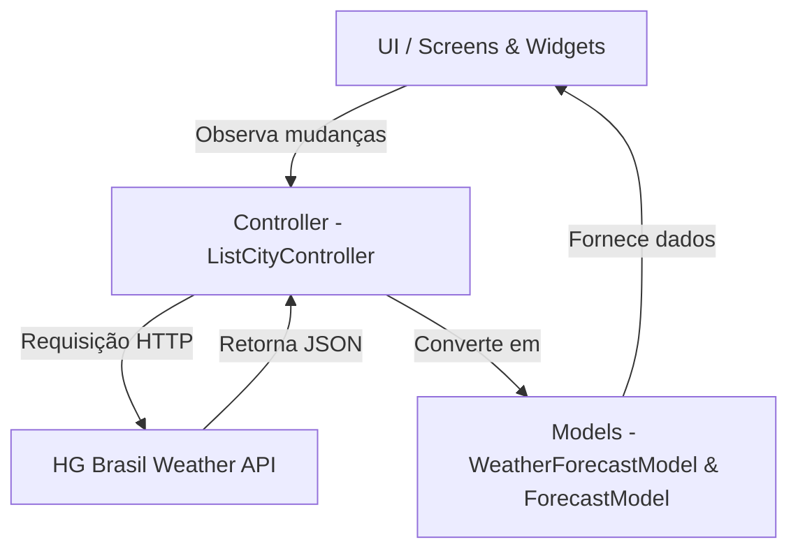

# 🌤️ Climapp

> **Projeto para as aulas de 4º ano de Ciência da Computação (2026.2)**

O **Climapp** é uma aplicação mobile desenvolvida em **Flutter** para consulta e acompanhamento de dados meteorológicos em tempo real, previsões diárias, fases da lua e detalhes climáticos de diversas cidades.

---

## 🏗️ Arquitetura do Projeto

O projeto adota a arquitetura **MVC (Model-View-Controller)** combinada com o gerenciamento de estado nativo do Flutter via **`ChangeNotifier`** e **`ListenableBuilder`**:



* **Models (`src/models/`)**: Representam as estruturas de dados climáticos e lidam com a serialização/desserialização de e para JSON.
* **Controllers (`src/controller/`)**: Centralizam a regra de negócio, busca de dados na API externa, filtragem e controle do estado de carregamento.
* **Views / Screens (`src/screens/`)**: Telas da aplicação que reagem às mudanças de estado notificados pelo Controller.
* **Widgets (`src/widgets/`)**: Componentes visuais de interface reutilizáveis.
* **Enums & Configurações (`src/enums/`)**: Constantes globais e chaves de ambiente.

---

## 📡 Origem dos Dados

Os dados meteorológicos e os recursos visuais são obtidos através dos serviços da **[HG Brasil Weather API](https://hgbrasil.com/status/weather)**:

* **Dados Climáticos**: `https://api.hgbrasil.com/weather` (parâmetros `key` e `city_name`).
* **Ícones de Condição do Tempo (SVG)**: `https://assets.hgbrasil.com/weather/icons/conditions/`
* **Ícones de Fases da Lua (PNG)**: `https://assets.hgbrasil.com/weather/icons/moon/`

---

## 🔑 Configuração da API KEY (`dart-define`)

Por razões de segurança, a **API KEY** da HG Brasil não fica hardcoded no código-fonte. Ela é lida dinamicamente em tempo de compilação utilizando `String.fromEnvironment('API_KEY')` no arquivo `enviroments_enum.dart`.

É **obrigatório** fornecer a variável `API_KEY` para que o aplicativo consiga carregar as informações meteorológicas.

### 1. Linha de Comando (Terminal)
```bash
flutter run --dart-define=API_KEY=sua_chave_aqui
```

### 2. VS Code (`.vscode/launch.json`)
Adicione o argumento `--dart-define` na sua configuração de inicialização:

```json
{
  "version": "0.2.0",
  "configurations": [
    {
      "name": "Climapp",
      "request": "launch",
      "type": "dart",
      "args": [
        "--dart-define",
        "API_KEY=sua_chave_aqui"
      ]
    }
  ]
}
```

### 3. Android Studio / IntelliJ IDEA
1. Vá até o menu superior: **Run** -> **Edit Configurations...**
2. Selecione a sua configuração de execução (ex: `main.dart`).
3. No campo **Additional run args** (ou **Dart entrypoint flags**), adicione:
   ```text
   --dart-define=API_KEY=sua_chave_aqui
   ```
4. Clique em **Apply** e **OK**.

---

## 📂 Estrutura de Arquivos e Suas Funções

Abaixo está o detalhamento do papel de cada arquivo no diretório `lib/`:

```text
lib/
├── main.dart
└── src/
    ├── controller/
    │   └── list_city_controller.dart
    ├── enums/
    │   └── enviroments_enum.dart
    ├── models/
    │   ├── forecast_model.dart
    │   └── weather_forecast_model.dart
    ├── screens/
    │   ├── list_city_screen.dart
    │   ├── weather_city_screen.dart
    │   └── welcome_screen.dart
    └── widgets/
        └── city_tile_widget.dart
```

### 📄 Detalhamento dos Arquivos

#### 🚀 `lib/main.dart`
Ponto de entrada (*entry point*) do aplicativo. Configura o `MaterialApp`, define o tema global (incluindo a tipografia personalizada com **Google Fonts - Montserrat**) e carrega a tela inicial (`WelcomeScreen`).

#### ⚙️ `lib/src/enums/enviroments_enum.dart`
Enum de configuração que centraliza as URLs base da API HG Brasil, as CDNs para ícones de clima e lua, e faz a leitura da variável de ambiente `API_KEY` enviada via `--dart-define`.

#### 📦 `lib/src/models/forecast_model.dart`
Modelo de dados responsável por mapear a previsão diária do tempo (mínima, máxima, umidade, nebulosidade, probabilidade de chuva, vento, horários de nascer/pôr do sol, fase da lua e descrição da condição).

#### 📦 `lib/src/models/weather_forecast_model.dart`
Modelo principal que representa as condições meteorológicas atuais de uma cidade (temperatura atual, condição, umidade, vento, fuso horário, etc.) e contém a lista das previsões diárias futuras (`List<ForecastModel>`).

#### 🎮 `lib/src/controller/list_city_controller.dart`
Controller da aplicação que herda de `ChangeNotifier`. É responsável por:
* Armazenar a lista de cidades buscadas (`allCities`) e filtradas (`filteredCities`).
* Executar as requisições HTTP REST para a API HG Brasil (`getWeatherForecast()`).
* Gerenciar o estado de carregamento (`isLoading`).
* Tratar a busca/filtragem de cidades em tempo real de acordo com a digitação do usuário.

#### 🖥️ `lib/src/screens/welcome_screen.dart`
Tela de boas-vindas (*splash/landing page*) com fundo em gradiente, exibe a logo do Climapp, ilustração de abertura e botão "Entrar" que direciona para a lista de cidades.

#### 🖥️ `lib/src/screens/list_city_screen.dart`
Tela principal de busca e exibição das cidades. Apresenta um campo de busca (`TextField`) com filtro dinâmico e utiliza um `ListenableBuilder` para escutar as alterações do `ListCityController`, exibindo a lista de cidades via `CityTileWidget` ou um `CircularProgressIndicator` enquanto carrega.

#### 🖥️ `lib/src/screens/weather_city_screen.dart`
Tela de detalhamento climático de uma cidade. Exibe a temperatura atual, ícone vetorial (SVG) da condição climática em tempo real, temperaturas mínimas/máximas e um carrossel horizontal (`CarouselView`) com as previsões estendidas e fases da lua.

#### 🧩 `lib/src/widgets/city_tile_widget.dart`
Widget de interface reutilizável em formato de card/ListTile que exibe o ícone SVG da condição meteorológica, o nome da cidade e a temperatura atual em °C.

---

## 🛠️ Pacotes e Dependências Utilizadas

* **[http](https://pub.dev/packages/http)**: Para consumo das requisições REST HTTP da API.
* **[flutter_svg](https://pub.dev/packages/flutter_svg)**: Para renderização vetorial de ícones de clima no formato SVG.
* **[google_fonts](https://pub.dev/packages/google_fonts)**: Para aplicar a família tipográfica Montserrat.
* **[flutter_map](https://pub.dev/packages/flutter_map)** & **[geolocator](https://pub.dev/packages/geolocator)**: Dependências para suporte a mapas e localização geográfica.
